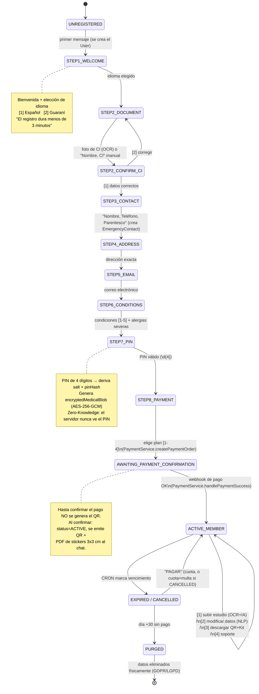
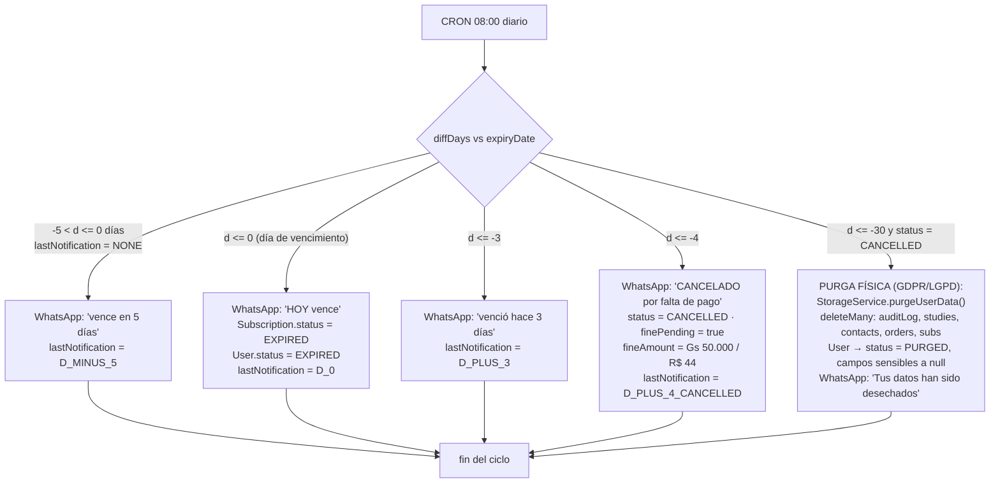

# Doorway Cortex Bio-Pass — Máquina de Estados del Bot de WhatsApp

Motor: **Baileys** (`@whiskeysockets/baileys`) → `backend/src/whatsapp/baileys.client.ts`
Dispatcher: `backend/src/whatsapp/bot-state-machine.ts` (`BotStateMachine.handleMessage`)
NLP: `backend/src/whatsapp/nlp-handler.ts`

El estado por usuario se persiste en `User.onboardingState` (+ buffer `User.onboardingData`).
Comando global `REINICIAR` → vuelve a `STEP1_WELCOME`.

## 1. Flujo conversacional (onboarding 100% self-service + menú activo)

### Ramas de entrada según `User.status` (cada mensaje entrante)

| Situación | Rama en `handleMessage` |
|---|---|
| No existe el número | crea `User`, responde bienvenida, `onboardingState = STEP1_WELCOME` |
| En onboarding | avanza por `STEPx_*` según `onboardingState` |
| `status = ACTIVE` | menú de miembro + procesado de media + NLP (`CHANGE_ALLERGY`, `CHANGE_CONTACT`, `CHANGE_ADDRESS`) |
| `status = EXPIRED` o `CANCELLED` | genera orden de renovación (con multa si `CANCELLED`), espera `PAGAR` |
| `status = PURGED` | mensaje genérico; requiere registro nuevo |

## 2. Ciclo de vida de la suscripción — CRON diario (08:00)

`backend/src/services/cron.service.ts` → `runSubscriptionCheck()` recorre las suscripciones
`ACTIVE | EXPIRED | CANCELLED` y calcula `diffDays = expiryDate - hoy`.

`lastNotification` (enum `NotificationStage`) es el candado de idempotencia: cada etapa se
envía una sola vez aunque el CRON corra a diario.

## 3. Alerta de escaneo (fuera del flujo conversacional)

Cada `GET /api/emergency/:token` (modo emergencia, sin PIN) inserta un `ScanAuditLog`
(IP geolocalizada con `geoip-lite`, `mode = EMERGENCY_NO_PIN`) y dispara un push por
WhatsApp al titular:

> ⚠️ Tu código fue escaneado hoy a las HH:MM en \[ciudad/país aprox. por IP\]. Si no fuiste tú, contacta a soporte.
