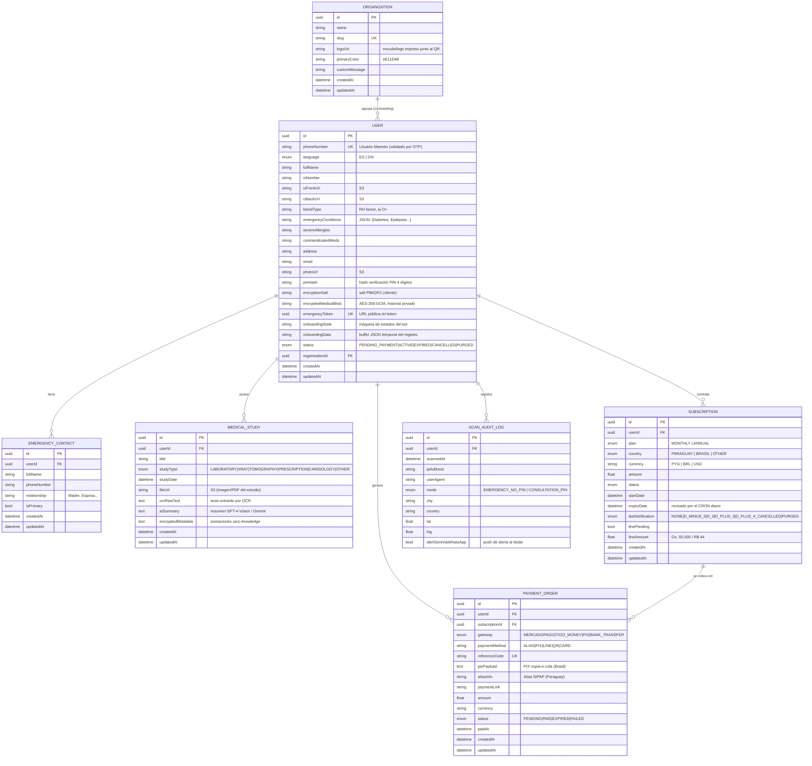

# Doorway Cortex Bio-Pass — Modelo Entidad-Relación

Base: **PostgreSQL** vía Prisma ORM (`backend/prisma/schema.prisma`).
Imágenes y estudios (`fileUrl`) viven en **S3 / MinIO**, nunca en la base.

## Notas de diseño

| Regla | Implementación |
|---|---|
| **Zero-Knowledge** | `encryptedMedicalBlob` y `MedicalStudy.encryptedMetadata` van cifrados AES-256-GCM con clave derivada de `PIN + encryptionSalt` en el cliente. El servidor guarda solo `pinHash` (verificación) y el `salt`. |
| **Purga GDPR/LGPD (día +30)** | Borrado físico en cascada: `onDelete: Cascade` en `EMERGENCY_CONTACT`, `MEDICAL_STUDY`, `SUBSCRIPTION`, `PAYMENT_ORDER`, `SCAN_AUDIT_LOG` al eliminar el `USER`; los objetos S3 se borran por el `ExportService` / job de purga. |
| **Identidad = teléfono** | `USER.phoneNumber @unique`; sin usuario/contraseña. Login = OTP + PIN. |
| **QR público** | `USER.emergencyToken @unique` → `https://bio-pass.com/e/{token}`. |
| **Cobranza escalonada** | `SUBSCRIPTION.expiryDate` + `lastNotification` mueven la notificación por el CRON (ver `docs/BOT-STATE-MACHINE.md`). |
